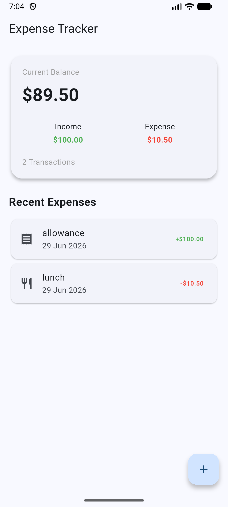
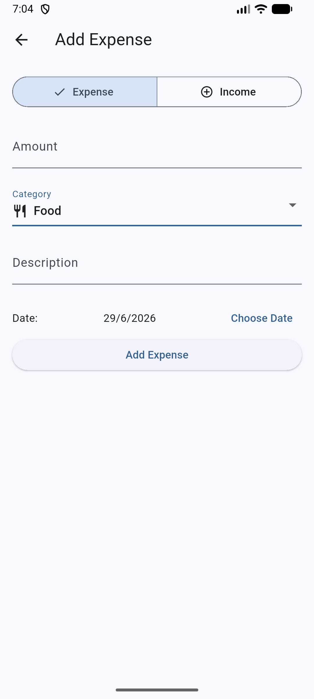

# 💰 Expense Tracker

A modern expense tracking mobile application built with Flutter that helps users record, organize, and monitor their daily expenses. The app provides an intuitive interface for managing personal finances and is designed with scalability in mind using a clean project architecture.

---

## 📱 Features

### Current Features
- 📊 Dashboard displaying Current balance, Total income, Total expenses and Number of transactions
- ➕ Add new transactions
- 💵 Support for both Income and Expense transactions
- 🗂 Dynamic categories based on transaction type
- 📝 Expense form with input validation
- 📅 Date picker for selecting expense date
- 📋 View all recorded transactions
- 💾 SQLite local database integration
- 🔄 Persistent data storage across app restarts
- ➖ Income and expense indicators with positive and negative amounts

### 📂 Supported Categories
Expense Categories
- 🍽️ Food
- 🚗 Transport
- 🛒 Shopping
- 🎬 Entertainment
- 🏠 Housing
- 🏥 Health
- ✈️ Travel
- 🧾 Other
Income Categories
- 💼 Salary
- 💵 Petty Cash
- 📈 Investment
- 💲 Other

### Planned Features
- 🗑 Delete expenses
- 📈 Monthly spending summary
- 📊 Expense charts and analytics
- 💰 Budget management
- 🔍 Search and filter expenses
- 🌙 Dark mode
- ☁️ Cloud synchronization

---

## 🛠 Tech Stack

- **Framework:** Flutter
- **Language:** Dart
- **Database:** SQLite (sqflite)
- **Date Formatting:** intl
- **IDE:** Visual Studio Code

---

## 📂 Project Structure

```text
lib/
│
├── models/
│   └── expense.dart
│
├── screens/
│   ├── home_screen.dart
│   └── add_expense_screen.dart
│
├── services/
│   ├── expense_service.dart
│   └── database_service.dart
│
├── widgets/
│   ├── balance_card.dart
│   └── expense_tile.dart
│
└── main.dart
```

---

## 🚀 Getting Started

### Prerequisites

- Flutter SDK
- Android Studio or VS Code
- Android Emulator or physical Android device

### Installation

1. Clone the repository

```bash
git clone https://github.com/ivriahtyx/Expense_Tracker.git
```

2. Navigate into the project

```bash
cd expense_tracker
```

3. Install dependencies

```bash
flutter pub get
```

4. Run the application

```bash
flutter run
```

---

## 📦 Dependencies

```yaml
flutter:
  sdk: flutter

sqflite:
path:
intl:
```

---

## 🖼 Screenshots

> Screenshots will be added as the application develops.
<p align="center">
  
  
</p>

<p align="center">
  <b>Home Screen</b> &nbsp;&nbsp;&nbsp;&nbsp;&nbsp;&nbsp;&nbsp;&nbsp;
  <b>Add Transaction</b>
</p>
---

## 📖 Learning Objectives

This project was developed to strengthen my knowledge in:

- Flutter UI development
- Stateful widget management
- Form validation
- Navigation between screens
- SQLite database integration
- Clean project architecture
- CRUD operations
- Mobile application development best practices

---

## 📝 Future Improvements

- Implement Provider for state management
- Add recurring expenses
- Export expense reports
- Multi-currency support
- Financial insights dashboard
- Expense categories with custom icons
- Unit testing
- Cloud backup

---

## 👨‍💻 Author

Developed by **Ivriahtyx**
